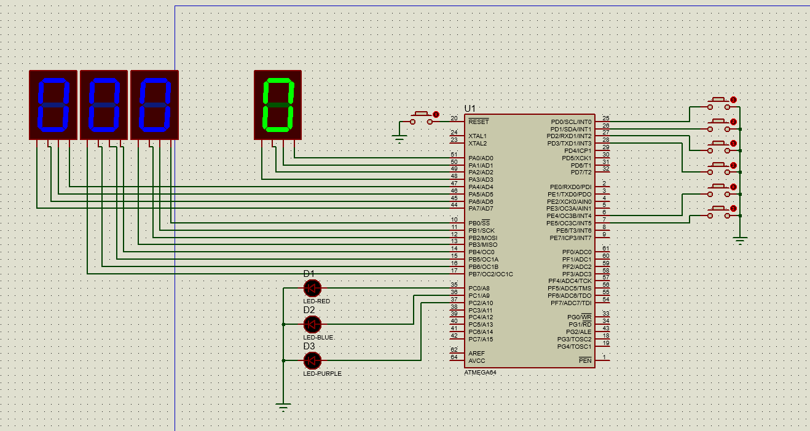

# ATmega64 Vehicle Control Simulator

Microprocessor project developed using AVR Assembly Language.

---

## Overview

This project simulates vehicle control functions including:

* Acceleration
* Braking
* Gear shifting

using an ATmega64 microcontroller.

---

## Technologies

* ATmega64
* AVR Assembly
* Proteus

---

## Features

### Acceleration

Vehicle speed increases when the acceleration button is pressed.

### Braking

Vehicle speed decreases when the brake button is pressed.

### Gear Shifting

User can change gears using dedicated buttons.

---

## Circuit Design

---

## Project Structure

source/
Assembly source code

proteus/
Proteus simulation files

screenshots/
Simulation images

docs/
Reports and documentation

---

## Learning Outcomes

* AVR Assembly Programming
* Embedded Systems
* I/O Management
* State Machine Design
